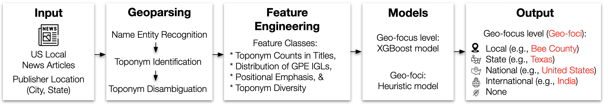
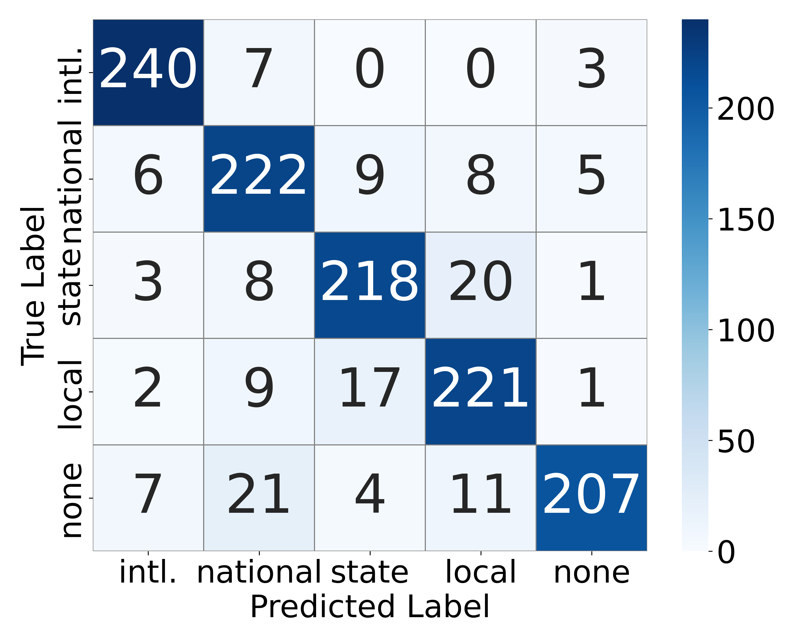
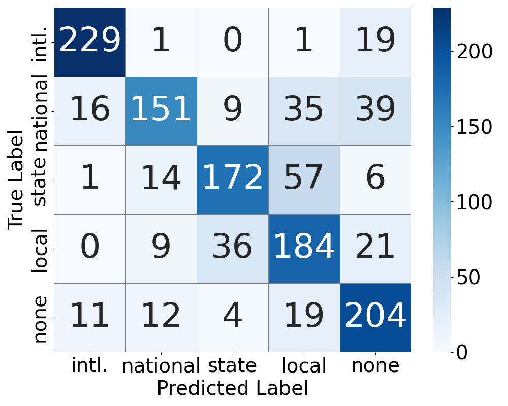
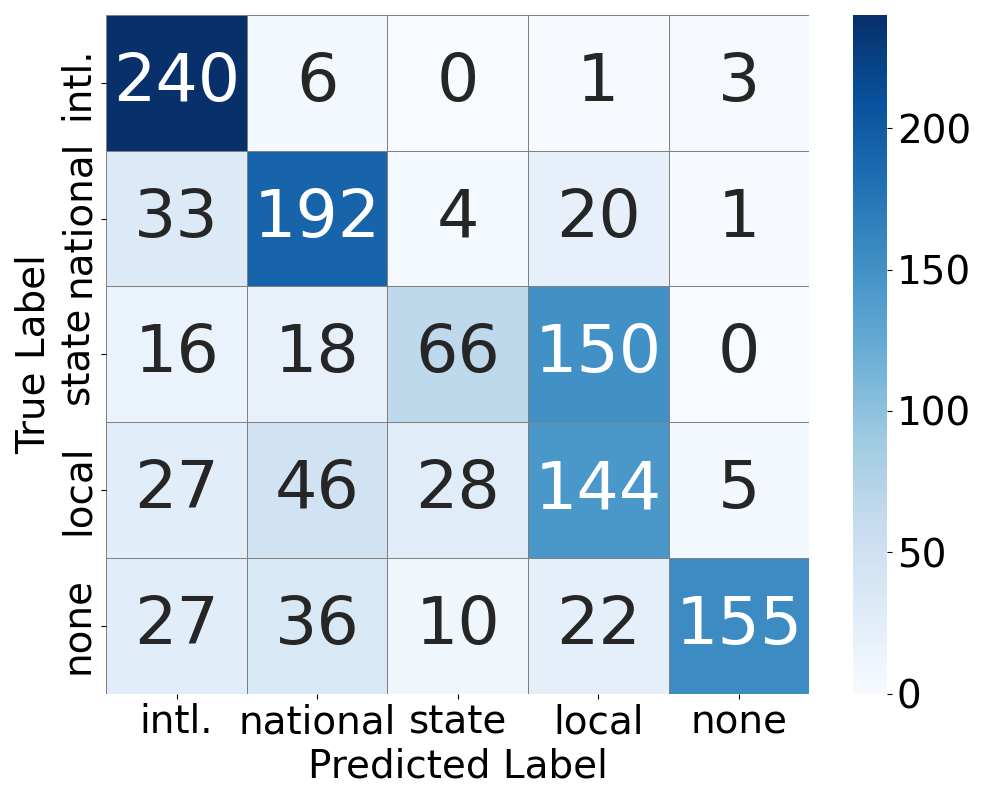

# NLGF: Identifying the Geographic Foci of US Local News

## 1. About

NLGF is a geo-focus identification model designed for US local news. It identifies the key geographic area central to an article’s subject matter and classifies the article’s geo-focus level into one of five categories: local, state, national, international, or none.

### Key Concepts

- **Geo-Focus**  
  The **geo-focus** of a news article refers to the primary geographical area that is central to its content.  

- **Geo-Focus Levels**  
  Each article is assigned to one of the following geo-focus levels:  

  - **Local**: Articles centered on a specific city, town, or county. Examples include local elections, school board decisions, or community events.  
  - **State**: Articles relevant to multiple communities within a single U.S. state, such as statewide legislation, policies, or political developments.  
  - **National**: Articles addressing issues of importance across the United States or spanning multiple states, including federal policies or nationwide trends.  
  - **International**: Articles focusing on events or issues outside the United States, such as foreign affairs or global crises.
  - **None**: Article with no clear geographic focus, instead discussing topics with broad appeal, such as scientific discoveries.



The above figure is a summary of the methodology.

Our contributions are as follows. First, our expert-annotated dataset is a valuable benchmark for future geo-focus research. Second, we adapted LLMs for toponym disambiguation and showed that they outperform traditional geoparsers. Third, we designed a set of spatial-semantic features that capture how geographic information is emphasized, distributed, and contextualized within articles. Finally, we combined these into this open-source classifier that accurately determines the geo-foci (and geo-focus level) of US local news articles.

 
## 2.Installation 

```
$ wget -O nlgf.zip wget -O nlgf.zip https://anonymous.4open.science/api/repo/NLGF-0D8D/zip
$ unzip nlgf.zip -d nlgf
$ cd nlgf/; pip install .;python -m spacy download en_core_web_sm; cd ..; rm nlgf.zip; rm -rf nlgf;
```


## 3.Data

The training dataset consisted of 1,250 US local news articles evenly split across all five geo-focus labels. We randomly extracted the local news articles (with publisher location metadata) from the [3DLNews2](https://github.com/wm-newslab/3DLNews2) dataset from all 50 US states. An expert manually annotated each article with one of five geo-focus labels.

### Data files
- Labelled dataset: [data.csv](data/data.csv)
- Labelled Dataset with generated features and the prediction with the NLGF model: [gf_data_with_prediction.csv](results/model/gf_data_with_prediction.csv)
- Labelled Dataset with the prediction with the GPT-4o model: [gpt-data.csv](results/gpt/gpt-data.csv)
- Labelled Dataset with the prediction with the Cliff-Clavin model: [cc-data.csv](results/cc/cc-data.csv)

### Annotation Process and Reliability

* Two domain experts independently annotated each article([data_labels.csv](data/labelling/data_labels.csv)) with:

  * Its geo-focus/foci
  * Its geo-focus level

* Annotation reliability was assessed using Inter-Rater Reliability (IRR) metrics for:

  * Single-label geo-focus level with [irr.py](data/labelling/irr.py)
  * Multi-label geo-foci with [irr-2.py](data/labelling/irr-2.py)

* Results showed strong annotation agreement, confirming the robustness of labels in the final dataset of 1,250 US local news articles:

  * Geo-focus level annotations:

    * Cohen’s κ = 0.83
    * Krippendorff’s α = 0.83
      
  * Geo-foci annotations:

    * Krippendorff’s α = 0.81

## 3. Method

This project consists of a multi-stage pipeline for:

- **Toponym Recognition**: Extracted geographic entities (cities, states, countries, etc.) using spaCy.
- **Toponym Disambiguation**: Resolved ambiguous locations with the help of large language models (GPT-4o) and geospatial validation.
  - The comparison that we have done for the toponym disambiguation with traditional geoparsers and LLMs can be found here: https://anonymous.4open.science/r/toporesolve-9176/README.md
  
- **Feature Engineering**: Extracted spatial-semantic features based on following four main classes.
  - **Toponym Counts in Titles**: The presence of toponyms in news titles is a strong indicator of spatial emphasis. We extracted the counts of toponyms in the titles of news articles for each geo-focus level.
    ```
    "title_topo_cnt_intl", "title_topo_cnt_national", "title_topo_cnt_state", "title_topo_cnt_local"
    ```
  - **Distributions of GPE IGLs**: This highlights how frequently different IGLs (Initial Geo-focus Labels) of Geo-political entity (GPE) toponyms are mentioned in an article. We extracted counts for each of their IGLs.
    ```
    "intl_igl_cnt", "national_igl_cnt", "state_igl_cnt", "local_igl_cnt"
    ```
  - **Positional Emphasis**: Mentioning a toponym early in a news article can be a strong indicator of spatial emphasis. We extracted and counted the IGLs for the first five toponyms.
    ```
    "leading_topo_intl_igl_cnt", "leading_topo_national_igl_cnt", "leading_topo_state_igl_cnt", "leading_topo_local_igl_cnt"
    ```
  - **Toponym Diversity**: Mentioning multiple different geographical regions could indicate a broad geo-focus. We measured toponym diversity by extracting the number of unique geographic identifiers (GEOIDs) for county and international IGLs. We excluded the state IGL for measuring toponym diversity since this indicates only one location (publisher's state).  
    ```
     "uniq_intl_igl", "uniq_national_igl", "uniq_local_igl"
    ```
- **Geo-Focus Identification**: A two-stage framework for analyzing the geo-focus of US local news articles:  

  - **Geo-Focus Level Classification**  
    - Uses an XGBoost ensemble to classify articles into four geo-focus levels.  
    - Model tuned via stratified 5-fold CV + grid search (learning rate=0.2, max depth=6, 25 estimators, subsample=0.9).  
    - Feature selection ensured low correlation (<0.85) and retained only predictive features (importance >0.005).  

  - **Geo-Focus Identification**  
    - Heuristic-based scoring of toponyms matching the predicted level.  
    - Scoring factors: frequency in title, total mentions, early occurrence, and GPE recognition.  
    - Scores normalized; toponyms above threshold (0.25, tuned for max F1) selected as final foci.  

## 4. Results

Results of the geo-focused identification with the XGBoost-based model.

**Geo-focus Level**

| Geo-focus level | Precision | Recall   | F1       |
| --------------- | --------- | -------- | -------- |
| Local           | **0.85**  | **0.88** | **0.87** |
| State           | **0.88**  | **0.87** | **0.88** |
| National        | **0.83**  | **0.89** | **0.86** |
| Intl.           | **0.93**  | **0.96** | **0.94** |
| None            | **0.95**  | **0.83** | **0.89** |
| **Macro avg**   | **0.89**  | **0.89** | **0.89** |

**Geo-focus**
 
| Precision | Recall | F1   |
|---------|--------|------|
| **0.86**  | **0.89** | **0.86** |



## 5. Experiment

### 5.1. GPT-4o

**Geo-focus Level**

Tested the GPT-4o model for the geo-focus identification task, and the following is the result.

| Geo-focus level | Precision | Recall | F1   |
| --------------- | --------- | ------ | ---- |
| Local           | 0.62      | 0.74   | 0.67 |
| State           | 0.78      | 0.69   | 0.73 |
| National        | 0.81      | 0.60   | 0.69 |
| Intl.           | 0.89      | 0.92   | 0.90 |
| None            | 0.71      | 0.82   | 0.76 |
| **Macro avg**   | 0.76      | 0.75   | 0.75 |

**Geo-focus**

| Precision | Recall | F1   |
|---------|--------|------|
| 0.65      | 0.69   | 0.66 |



### 5.2. Cliff-Clavin

**Geo-focus Level**

Cliff-Clavin was designed to identify geo-foci rather than geo-focus levels. However, the predicted geo-foci can be mapped to geo-focus levels using rule-based aggregation with [cliff-clavin-geo-focus-level.py](NLGF/nlgf/cliff-clavin-geo-focus-level.py), enabling its use as a baseline for geo-focus level classification

| Geo-focus level | Precision | Recall | F1   |
| --------------- | --------- | ------ | ---- |
| Local           | 0.43      | 0.58   | 0.49 |
| State           | 0.61      | 0.26   | 0.37 |
| National        | 0.64      | 0.77   | 0.70 |
| Intl.           | 0.70      | 0.96   | 0.81 |
| None            | 0.95      | 0.62   | 0.75 |
| **Macro avg**   | 0.67      | 0.64   | 0.62 |


**Geo-focus**

| Precision | Recall | F1   |
|---------|--------|------|
| 0.29      | 0.64   | 0.37 |




## 6. Usage

### 6.1 Predicting Geo-Focus

First, navigate to the `NLGF/nlgf` directory and execute the following commands

Export the GPT-4o API key as follows, as it is required for toponym disambiguation.
```
export OPENAI_API_KEY=<your_api_key_here>
```

To predict the geographic focus of a US local news article using the NLGF model, run:

```
$ python predict.py --article_link <article-url> --publisher_longitude <longitude> --publisher_latitude <latitude>
```

Following is an example
```
$ python predict.py --article_link "https://www.canoncitydailyrecord.com/2024/05/24/colorado-artificial-intelligence-ai-law-regulations-tech-congress-discrimination/" --publisher_longitude -105.27973 --publisher_latitude "38.464212"
```

### 6.2 Reproducing Results
To reproduce the results reported in the paper, first navigate to `NLGF/nlgf` directory and execute the following commands


#### 6.2.1 NLGF model results
  Run the following command to reproduce NLGF geo-focus classification results.
  ```
  $ python train.py
  ```
#### 6.2.2 GPT-4o model results:
  Run the following command to reproduce GPT-4o geo-focus classification results.
  ```
  $ python evaluate_gpt.py
  ```
#### 6.2.3 Cliff-Clavin model results:
  Run the following command to reproduce Cliff-Clavin geo-focus classification results.
  ```
  $ python evaluate_cliff_clavin.py
  ```


